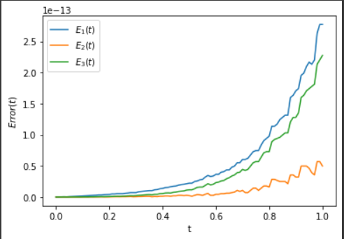

# Ordinary Differential Equation
Let us consider the system of $\textbf{ODE}$ given by

$$\begin{equation}
\dfrac{du}{dt} = Au + F(u, t) \quad on \quad [a, b],
\end{equation}$$

where $A\in \mathbb{R}^m \times \mathbb{R}^m$, $u \in \mathbb{R}$ and $F$ a non linear function

By multiplying the equation $(1)$ by the integrator factor $e^{-At}$, we have

$$\begin{align*}
    e^{-At}\dfrac{du}{dt} =& \; e^{-At}Au + e^{-At}F(u, t) \\
    e^{-At}\dfrac{du}{dt} - e^{-At}Au =& \; e^{-At}F(u, t) \\
    \dfrac{du}{dt}(ue^{-At}) =& \; e^{-At}F(u(t), t) \\
    \int_{t_n}^{t_{n+1}} \dfrac{du}{dt}(ue^{-At})dt =& \; \int_{t_n}^{t_{n+1}} e^{-At}F(u(t), t)dt \\
    \Longrightarrow \quad u(t_{n + 1})e^{-At_{n + 1}} - u(t_n)e^{-At_n} =& \; \int_{t_n}^{t_{n+1}} e^{-At}F(u(t), t)dt \\
    u(t_{n + 1})e^{-At_{n + 1}} =& \; u(t_n)e^{-At_n} + \int_{t_n}^{t_{n+1}} e^{-At}F(u(t), t)dt \\
    u(t_{n + 1}) =& \; u(t_n)e^{At_{n + 1}}e^{-At_n} + e^{At_{n + 1}}\int_{t_n}^{t_{n+1}} e^{-At}F(u(t), t)dt \\
    u(t_{n + 1}) =& \; u(t_n)e^{A(t_{n+1}-t_n)} + \int_{t_n}^{t_{n+1}} e^{A(t_{n+1}-t)}F(u(t), t)dt \\
    u(t_{n + 1}) =& \; u(t_n)e^{hA} + \int_{t_n}^{t_{n+1}} e^{A(t_{n+1}-t)}F(u(t), t)dt, \quad since \; h = t_{n+1} - t_n \\
\end{align*}$$

Let $\tau = t - t_n \quad \Longrightarrow \quad d\tau = dt $

When

$$\begin{align*}
t = t_n & \Rightarrow \tau = 0 \\
t = t_{n+1} & \Rightarrow \tau = t_{n+1} - t_n = h \\
\end{align*} 
$$

So 

$$\begin{align*}
    u(t_{n + 1}) =& \; u(t_n)e^{hA} + \int_0^h e^{A(t_{n+1}-(\tau + t_n))}F(u(\tau + t_n), \tau + t_n)d\tau \\
    u(t_{n + 1}) =& \; u(t_n)e^{hA} + \int_0^h e^{A(h-\tau)}F(u(\tau + t_n), \tau + t_n)d\tau \\
    u(t_{n + 1}) =& \; u(t_n)e^{hA} + \int_0^h e^{-(\tau - h)A}F(u(\tau + t_n), \tau + t_n)d\tau \\
\end{align*}$$

Let $u_n \approx u(t_n)$, $F_n = F(u(t_n), t_n)$ and assume F is constant. Then we have
$$\begin{align*}
    u(t_{n + 1}) =& \; u(t_n)e^{hA} + \int_0^h e^{-(\tau - h)A}F(u(\tau + t_n), \tau + t_n)d\tau \\
    u(t_{n + 1}) =& \; u(t_n)e^{hA} + F\int_0^h e^{-(\tau - h)A}d\tau \\
    u(t_{n + 1}) =& \; u(t_n)e^{hA} + Fe^{hA}\int_0^h e^{-\tau A}d\tau \\
    u(t_{n + 1}) =& \; u(t_n)e^{hA} + Fe^{hA}\left[ -A^{-1}e^{-\tau A} \right]_{0}^{h} \\
    u(t_{n + 1}) =& \; u(t_n)e^{hA} + Fe^{hA}\left[ -A^{-1}e^{-h A} + A^{-1} \right] \\
    u(t_{n + 1}) =& \; u(t_n)e^{hA} + \left(e^{h A} - I \right)A^{-1}F \\[0.5cm]
    u_n \approx u(t_n) \quad and \quad F_n \approx F \quad \Longrightarrow \quad u_{n + 1} =& \; u_ne^{hA} + \left(e^{h A} - I \right)A^{-1}F_n
\end{align*}$$

# Importing package
```python
import numpy as np
from scipy.linalg import inv
from scipy.linalg import expm
import matplotlib.pyplot as plt
```

# Define function ExpoMethod
```python
def ExpoMethod(a, b, A, F, h, u0):
    
    m = len(u0)
    
    #Generating partition
    N = int((b-a)/h + 1)
    T = np.linspace(a, b, N)
    
    #Computing some constant of the method
    ehA = expm(h*A)
    I = np.identity(m)
    A_inv = inv(A)
    c = (ehA - I)@A_inv
    
    #Create a matrix such that each column is a solution of the method 
    U = np.zeros( (N, m) )
    U[0] = u0
    
    for n in range(N-1):
        U[n + 1] = ehA@U[n] + c@F(U[n], T[n])
    return U, T
```

# Let us consider the system of ODE

$$\begin{equation}
    \dfrac{du}{dt} = Au \quad u(0) = u_0
\end{equation}$$

With 

$$A = \begin{pmatrix} 
    2 & 2 & 1 \\
    1 & 3 & 1 \\
    1 & 2 & 2 
\end{pmatrix}$$ 

and

$$u_0 = \begin{pmatrix} 
    1 \\
    0 \\
    0 
\end{pmatrix}$$

The exact solution of the equation is:

$$ x(t) = \begin{pmatrix} 
    \dfrac{3}{4}e^t +  \dfrac{1}{4}e^{5t} \\
    -\dfrac{1}{4}e^t +  \dfrac{1}{4}e^{5t} \\
    -\dfrac{1}{4}e^t +  \dfrac{1}{4}e^{5t}
\end{pmatrix}$$

# Define code plot the exact solution and the approximation of the equation above, using the function ExpoMethod
```python
def exact(t):
    x1 = ((3/4)*np.exp(t) + (1/4)*np.exp(5*t))
    x2 = ((1/4)*np.exp(5*t) - (1/4)*np.exp(t))
    x3 = x2
    return np.array([x1, x2, x3])

# Define the function F like a null vector
def F(u,t):
    return np.array([0, 0, 0])

#parameters
a = 0
b = 1
h = 0.01

#initial condition
u0 = np.array([1, 0, 0])

#matrix of the system
A = np.array([
    [2, 2, 1],
    [1, 3, 1],
    [1, 2, 2]])


#The approximation and time
u, t = ExpoMethod(a, b, A, F, h, u0)

#Exact solution
x = exact(t)

#plot
fig, axes = plt.subplots(2, 2,figsize=(10,10))
plt.subplots_adjust(hspace=0.3, wspace=0.3)

axes[0,0].plot(t, x[0], t, u[:,0])
axes[0,0].set_xlabel('t')
axes[0,0].set_ylabel('$x_1(t)$')
axes[0,0].legend(['Exact $x_1(t)$', 'Approx'],loc='upper left')

axes[0,1].plot(t, x[1], t, u[:,1])
axes[0,1].set_xlabel('t')
axes[0,1].set_ylabel('$x_2(t)$')
axes[0,1].legend(['Exact $x_2(t)$', 'Approx'],loc='upper left')

axes[1,0].plot(t, x[2], t, u[:,2])
axes[1,0].set_xlabel('t')
axes[1,0].set_ylabel('$x_3(t)$')
axes[1,0].legend(['Exact $x_3(t)$', 'Approx'],loc='upper left')


plt.show()
```


# Absolute Errors

```python
# Errors
E1 = abs(x[0] - u[:, 0])
E2 = abs(x[1] - u[:, 1])
E3 = abs(x[2] - u[:, 2])

plt.plot(t, E1, t, E2, t, E3)
plt.xlabel('t')
plt.ylabel('$Error(t)$')
plt.legend(['$E_1(t)$', '$E_2(t)$', '$E_3(t)$'],loc='upper left')
plt.show()
```


<!--  -->

