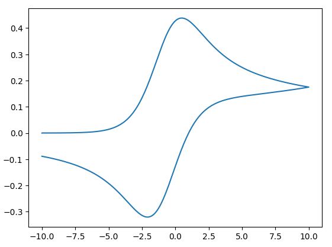
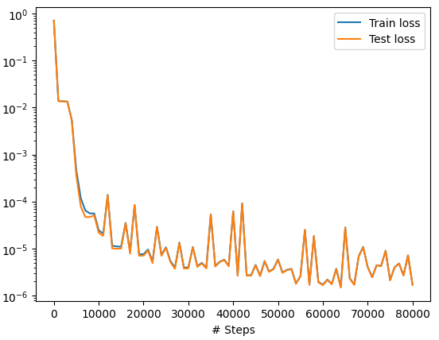
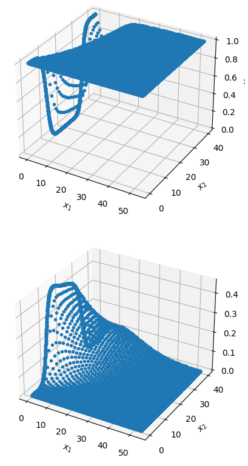
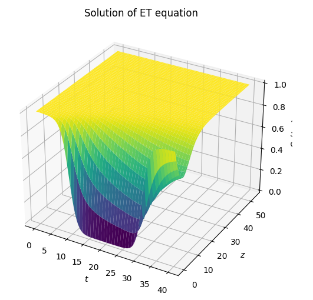
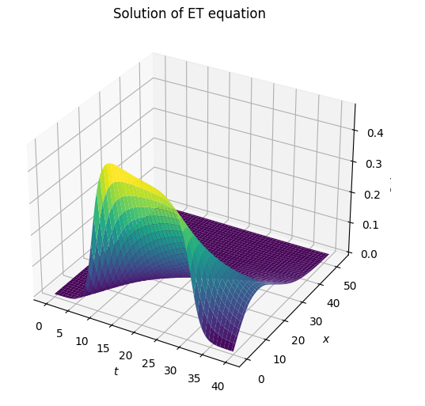
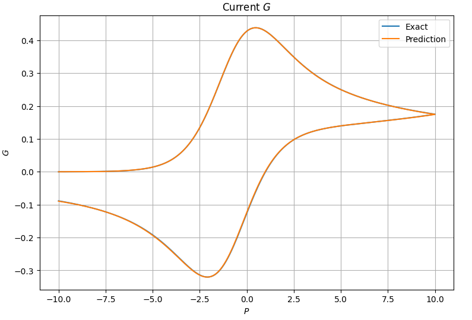

We will solve a forward problem for ET systems:

$$
\begin{aligned}
    \partial_t C_Q - \partial_z(D\partial_z C_Q) &= 0, \quad && \quad (t, z) \in [0,2t_{\lambda}] \times [0, z_1],\\
   \partial_t C_{Q^+} - \partial_z(D^+\partial_z C_{Q^+}) &= 0, \quad &&\quad (t, z) \in [0,2t_{\lambda}] \times [0, z_1].
\end{aligned}
$$

Subject to the boundary conditions:

$$
\begin{aligned}
\partial_z C_{i}(t, z_1) &= 0, \quad \forall i \in {Q, Q^+} \quad && \quad \forall (t, z) \in [0,2t_{\lambda}] \times [0, z_1],\\
D\partial_z C_Q(t, 0)  &= K_f(t)C_Q(t, 0) - K_b(t)C_{Q^+}(t, 0), \quad && \quad \forall t \in [0,2t_{\lambda}], \\
D^+\partial_z C_{Q^+}(t, 0) &= -K_f(t)C_Q(t, 0) + K_b(t)C_{Q^+}(t, 0), \quad && \quad \forall t \in [0,2t_{\lambda}].
\end{aligned}
$$

And the initial condition:

$$
\begin{equation}
C_Q(0, z) = 1, \quad C_{Q^+}(0, z) = 0, \quad \quad \forall z\in [0,z_1].
\end{equation}
$$

Here $C_{i}(t,z)\in\mathbb{R}$ is the dimensionless concentration of the species $i\in \{\mathbf{Q},\mathbf{Q}^{+}\}$ and $D^+\in\mathbb{R}$ is the dimensionless diffusion of the specie $\mathbf{Q}^{+}$. The heterogeneous electron transfer rate constants, $k_b, k_f$, can  be written in its dimensionless form, $K_b, K_f$,  as follows:

$$
\begin{equation}
K_f = K_0\exp[(1-\delta)P], \quad \quad K_b = K_0\exp[(-\delta) P].
\end{equation}
$$

Where the dimensionless potential, $P$, in terms of the dimensionless time, is given by:

$$
\begin{align}
P = \left\lbrace
\begin{array}{ll}
P_1 + t , \; 0\leq t\leq t_\lambda\\
P_2 -  (t - t_\lambda) , \; t_\lambda\leq t\leq 2t_\lambda
\end{array} 
\right.,\qquad
t_\lambda = P_2-P_1,
\end{align}
$$

With $P_1$ and $P_2$ respectively the dimensionless initial and reverse potential. The dimensionless current, $G$, is given by:

$$
\begin{equation}
G(t) = \partial_zC_Q(t, 0)  = K_f(t)C_Q(t, 0) - K_b(t)C_{Q^+}(t, 0), \quad \forall t\in [0,2t_{\lambda}].
\end{equation}
$$

```python
import numpy as np

# Set constants
pi = np.pi
delta = 0.5  # Electron transfer coefficient
D_A = 1  # Ratio of diffusion coefficient of A
D_plus = 1  # Ratio of diffusion coefficient of B
K0 = 20  # Dimensionles electron transfer rate constant
p1 = -10  # Starting dimensionless potential
p2 = 10  # End dimensionless potential
D_depth = 5 * (2 * pi * (p2 + 8)) ** 0.5
t_lambda = p2-p1
```

```python
def dimensionless_potential(t):
    p = np.where(t <= t_lambda, p1 + t, p2 - (t - t_lambda))
    return p

def electron_transfer_rates(P):
    Kf = K0 * np.exp((1 - delta) * P)
    Kb = K0 * np.exp((-delta) * P)
    return Kf, Kb
```

# Supervised Approach

```python
import scipy.io
import os
import deepxde as dde

data_folder = "data"
result_folder = "Results"
image_folder = "Figure"


def read_data(D_plus, K0):
    filename = f"Data_D_{D_plus}_K0_{K0}.mat"
    filename_path = os.path.join(data_folder, filename)
    mat = scipy.io.loadmat(filename_path)

    T_span = mat["T_span"][0]
    Z_set = np.zeros_like(T_span)
    X = np.stack([Z_set, T_span], axis=1)
    G = mat["G"][0]
    pot = mat["pot"][0]
    K0 = mat["K0"][0,0]
    D_plus = mat["D"][0,0]
    return D_plus, K0, X, pot, G

D = 1
D_plus, K0, X, pot, G = read_data(D_plus=5, K0=10)

import matplotlib.pyplot as plt

plt.plot(pot, G)
plt.show()
```



# Setup the Architecture

```python
geom = dde.geometry.Interval(0.0, D_depth)
timedomain = dde.geometry.TimeDomain(0.0, 2*t_lambda)
geomtime = dde.geometry.GeometryXTime(geom, timedomain)

def pde(x, y):
    cq_t = dde.grad.jacobian(y, x, i=0, j=1)
    cqp_t = dde.grad.jacobian(y, x, i=1, j=1)
    cq_zz = dde.grad.hessian(y, x, component=0, i=0, j=0)
    cqp_zz = dde.grad.hessian(y, x, component=1, i=0, j=0)
    eq1 = cq_t - D*cq_zz
    eq2 = cqp_t - D_plus*cqp_zz
    return [eq1, eq2]

def boundary_left(x, on_boundary):
    if dde.utils.isclose(x[1], 0.0):
        return False
    return on_boundary and dde.utils.isclose(x[0], 0.0)

def boundary_right(x, on_boundary):
    if dde.utils.isclose(x[1], 0.0):
        return False
    return on_boundary and dde.utils.isclose(x[0], D_depth)

def initial(x, on_initial):
    return on_initial and dde.utils.isclose(x[1], 0.0)

def boundary_left_t0(x, on_boundary):
    return on_boundary and dde.utils.isclose(x[0], 0.0) and dde.utils.isclose(x[1], 0.0)

def robin_boundary_condition_cq(x, y):
    t = x[:, 1]
    cq = y[:, 0]
    cqp = y[:, 1]
    P = dimensionless_potential(t)
    k_f, k_b = electron_transfer_rates(P)
    r = (1.0/D)*(k_f*cq - k_b*cqp)
    return r

def robin_boundary_condition_cqp(x, y):
    t = x[:, 1]
    cq = y[:, 0]
    cqp = y[:, 1]
    P = dimensionless_potential(t)
    k_f, k_b = electron_transfer_rates(P)
    r = (1.0/D_plus)*(-k_f*cq + k_b*cqp)
    return r
    
def dydx(x, y, X):
    return dde.grad.jacobian(y, x, i=0, j=0)

observe_g = dde.icbc.PointSetOperatorBC(X, G.reshape(-1, 1), dydx)

bc1 = dde.icbc.NeumannBC(geomtime, lambda x: 0.0, boundary_right, component=0)
bc2 = dde.icbc.NeumannBC(geomtime, lambda x: 0.0, boundary_right, component=1)
bc3 = dde.icbc.RobinBC(geomtime, robin_boundary_condition_cq, boundary_left, component=0)
bc4 = dde.icbc.RobinBC(geomtime, robin_boundary_condition_cqp, boundary_left, component=1)
ic1 = dde.icbc.IC(geomtime, lambda x: 1.0, initial, component=0)
ic2 = dde.icbc.IC(geomtime, lambda x: 0.0, initial, component=1)

# Define the PDE problem and configurations of the network:
data = dde.data.TimePDE(
    geomtime,
    pde,
    [ic1, ic2, bc1, bc2, bc3, bc4, observe_g],
    num_domain=20000,
    num_boundary=1000,
    anchors=X,
    num_initial=1000,
    num_test=2000
)

layer_size = [2] + [20] * 3 + [12] * 3 + [2]
activation = 'tanh'
initializer = 'Glorot uniform'
net = dde.nn.FNN(layer_size, activation, initializer)

model = dde.Model(data, net)
loss_weights = [1, 1, 1, 1, 1, 1, 1e-5, 1e-5, 1]
model.compile("adam", lr=0.001, loss_weights=loss_weights)

losshistory, train_state = model.train(iterations=80000)
dde.saveplot(losshistory, train_state, issave=True, isplot=True)
```





```python
N = 100
m = 100

# Draw uniformly sampled collocation points
t_r = np.linspace(0, 2*t_lambda, N)
x_r = np.linspace(0, D_depth, m)
X, T = np.meshgrid(x_r, t_r)

Xgrid = np.vstack([X.flatten(), T.flatten()]).T
y_pred = model.predict(Xgrid)

# Reshape upred
Cq = y_pred[:, 0].reshape((m, N))
Cq_plus = y_pred[:, 1].reshape((m, N))

import matplotlib.pyplot as plt

# Surface plot of solution u(t,x)
fig = plt.figure(figsize=(9, 6))
ax = fig.add_subplot(111, projection='3d')
ax.plot_surface(T, X, Cq, cmap='viridis');
ax.set_xlabel('$t$')
ax.set_ylabel('$z$')
ax.set_zlabel('$C_Q(t, x)$')
ax.set_title('Solution of ET equation');
```



```python
# Surface plot of solution u(t,x)
fig = plt.figure(figsize=(9,6))
ax = fig.add_subplot(111, projection='3d')
ax.plot_surface(T, X, Cq_plus, cmap='viridis');
ax.set_xlabel('$t$')
ax.set_ylabel('$x$')
ax.set_zlabel('$C_Q(t,x)$')
ax.set_title('Solution of ET equation');
```



```python
_, _, X, pot, G = read_data(D_plus=5, K0=10)

m = X.shape[0]

t_r = X[:, 1]
x_r = np.linspace(0, D_depth, m)*0.0

X = np.stack([x_r, t_r], axis=1)

def dydz(x, y):
    return dde.grad.jacobian(y, x, i=0, j=0)

G_hat = model.predict(X, operator=dydz)

# Surface plot of solution u(t,x)
fig = plt.figure(figsize=(9,6))
plt.plot(pot, G)
plt.plot(pot, G_hat)
plt.xlabel('$P$')
plt.ylabel('$G$')
plt.grid('on')
plt.title('Current $G$')
plt.legend(["Exact", "Prediction"])
plt.show()
```

